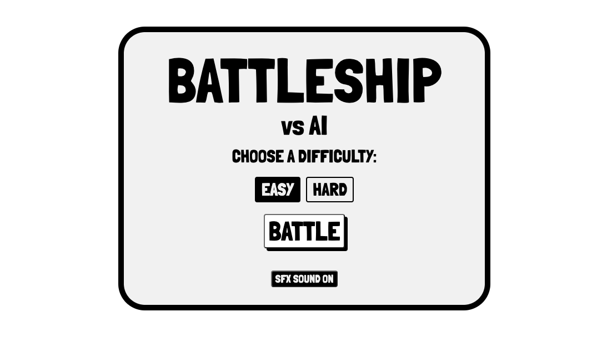
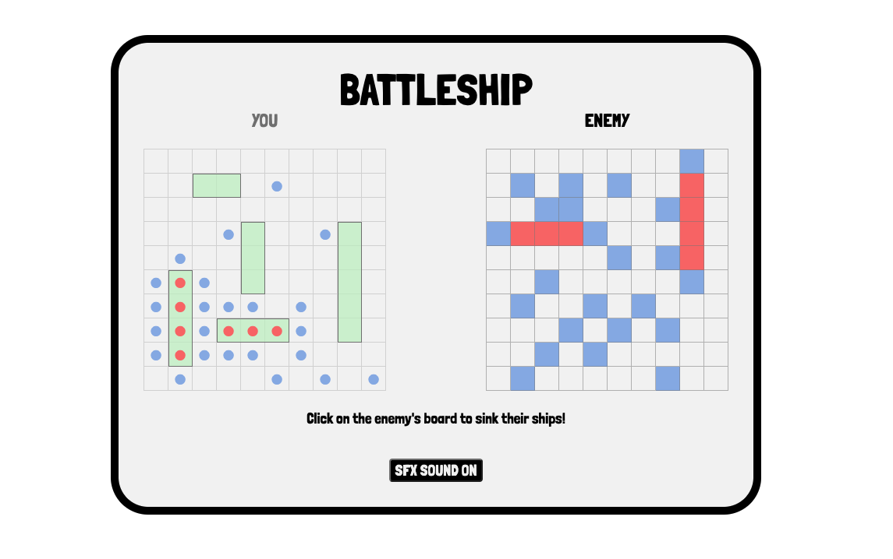

# Battleship
This project is a game of battleship vs AI. The AI has 2 difficulty levels, easy and hard. The easy AI uses a random number algorithm, the hard AI uses a Hunt/Target Parity algorithm.

## Screenshot

## Technologies Used
* HTML
* CSS
* JavaScript

## Getting Started
[Click Here](https://hanjun1.github.io/battleship/) to play the game!

## Next Steps
1. HTML5 Drop and Drop API does not support mobile or IE, thus need to add a different way of dragging and dropping
2. Refine algorithm for hard AI and add a medium AI
